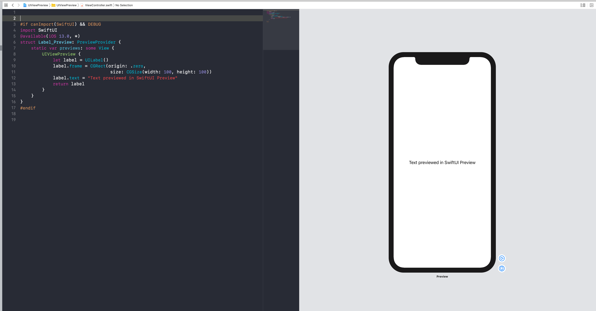

_Matt Thompson's_ beautiful gist for PreviewProvider turned into Swift Package.

# UIViewPreview Swift Package

Swift Package contains:
* `UIViewPreview`
* `UIViewControllerPreview`


Please read more about the use-cases for `UIViewPreview` in the `NSHipster` blogpost:
[https://nshipster.com/swiftui-previews/](https://nshipster.com/swiftui-previews/)

## Requirements:
* macOS Catalina
* Xcode 11.0 and above
* Swift 5.1 and above
* iOS 13.0 and above

## Installation
### Swift Package Manager

Add
`.package(url: "https://github.com/bielikb/UIViewPreview.git", from: "1.0.0")`
to your `Package.swift` file's `dependencies`.

If youre using Xcode 11.0 add this Swift Package to your target(s) using Xcode.


## PreviewProvider (Official Apple Docs)

```
/// Produces view previews in Xcode.
///
/// Xcode statically discovers types that conform to `PreviewProvider` and
/// generates previews in the canvas for each provider it discovers.
@available(iOS 13.0, OSX 10.15, tvOS 13.0, watchOS 6.0, *)
public protocol PreviewProvider : _PreviewProvider
```

## Example:

```
#if canImport(SwiftUI) && DEBUG
import SwiftUI
@available(iOS 13.0, *)
struct LabelCollectionView_Preview: PreviewProvider {
    static var previews: some View {
        UIViewPreview {
            let label = UILabel()
            label.frame = CGRect(origin: .zero,
                                 size: CGSize(width: 100, height: 100))
            label.text = "Text previewed in SwiftUI Preview"
            return label
        }
    }
}
#endif
```




## LICENSE
https://unlicense.org
